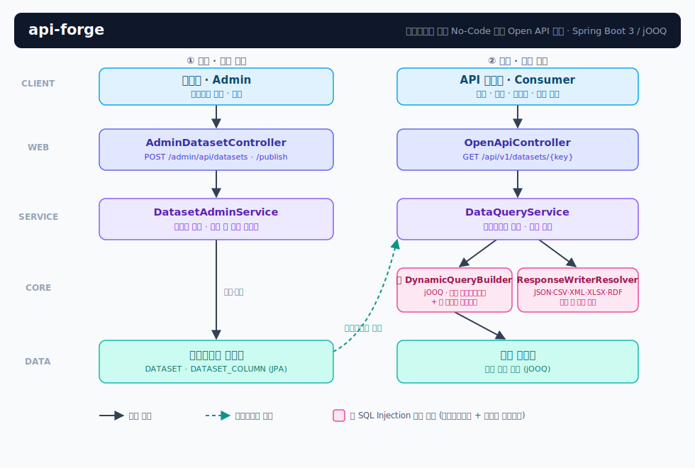

# api-forge

[](https://github.com/hello-pebble/api-forge/actions/workflows/ci.yml)
[](https://openjdk.org/projects/jdk/21/)
[](https://spring.io/projects/spring-boot)

> **메타데이터 기반 No-Code 동적 Open API 생성 플랫폼**
>
> 관리자가 DB 테이블·칼럼 설정만 등록하면, 코드 수정·배포 없이 즉시 필터·정렬·페이징·멀티포맷을 지원하는 Open API가 생성됩니다.

## 배경

공공데이터 Open API 시스템(Java 8 / Spring MVC 4 / iBatis 기반 레거시)을 운영하며 설계했던 **메타데이터 기반 동적 API 생성 엔진**을, 그 구조적 한계를 되짚어 현대 스택으로 다시 설계한 리팩토링 프로젝트입니다. 실제 운영 시스템의 소스는 비공개이며, 이 저장소는 핵심 아키텍처만 클린룸으로 재구현한 것입니다. 목표는 레거시에서 겪은 문제(문자열 SQL 조립, XML 설정 산재, 타입 불안정)를 설계 차원에서 해결하는 것입니다.

| 레거시 (운영 경험) | api-forge (재설계) |
|---|---|
| 문자열 연결 SQL 조립 + 블랙리스트 인젝션 필터 | **jOOQ 타입 세이프 DSL + 메타데이터 화이트리스트** — 식별자는 등록된 것만, 값은 전부 바인드 파라미터 |
| `switch` 포맷 분기 (수정 시 코드 변경) | **Writer 전략 빈 자동 수집** — 구현체 추가만으로 신규 포맷 등록 |
| XML 설정 + 메서드 명명 규칙 트랜잭션 | Spring Boot 3 자동설정 + `@Transactional` |
| `Map` 기반 파라미터 (타입 불안정) | DTO + Bean Validation |
| 수동 테스트 | 단위·통합 테스트 29건 + GitHub Actions CI |

## 아키텍처



**핵심 흐름** — 레거시와 동일한 개념, 안전한 구현:

1. 관리자가 데이터셋(소스 테이블 + 노출 칼럼 + 필터 유형)을 등록·발행
2. 요청 파라미터를 등록된 칼럼 메타데이터와 대조 (미등록 칼럼 → 400)
3. jOOQ DSL로 SELECT/WHERE/ORDER BY 조립 — 값은 전부 바인드 파라미터
4. 결과셋을 format 파라미터에 맞는 Writer 전략으로 직렬화

## 실행

```bash
./mvnw spring-boot:run
```

시드 데이터(의안 정보 예시, 가상 데이터 15건)가 자동 등록·발행됩니다.

```bash
# 카탈로그 — 사용 가능한 데이터셋과 필터·정렬 칼럼 확인
curl http://localhost:8080/api/v1/datasets

# 기본 조회
curl "http://localhost:8080/api/v1/datasets/bills"

# 필터 + 정렬 + 페이징
curl "http://localhost:8080/api/v1/datasets/bills?COMMITTEE=행정안전위원회&sort=PROPOSE_DT,desc&page=0&size=10"

# 의안명 부분 검색 (WORDS) / 날짜 범위 (DATE)
curl "http://localhost:8080/api/v1/datasets/bills?BILL_NM=데이터"
curl "http://localhost:8080/api/v1/datasets/bills?PROPOSE_DT=2026-01-01,2026-03-31"

# CSV / XML 포맷
curl "http://localhost:8080/api/v1/datasets/bills?format=csv"
curl "http://localhost:8080/api/v1/datasets/bills?format=xml"
```

### 새 API를 코드 없이 만들기

```bash
# 1. 데이터셋 등록 (관리자 인증: 기본 admin/admin1234 — 데모용, 환경변수로 재정의)
curl -X POST http://localhost:8080/admin/api/datasets \
  -u admin:admin1234 -H "Content-Type: application/json" \
  -d '{
    "datasetKey": "bills-mini",
    "name": "의안 요약",
    "sourceTable": "NA_BILL",
    "columns": [
      {"sourceColumn": "BILL_ID", "displayName": "의안번호", "filterType": "EQUALS", "sortable": true},
      {"sourceColumn": "BILL_NM", "displayName": "의안명", "filterType": "WORDS", "sortable": false}
    ]
  }'

# 2. 발행 — 소스 테이블·칼럼 실존 검증 후 즉시 노출
curl -X POST http://localhost:8080/admin/api/datasets/bills-mini/publish -u admin:admin1234

# 3. 끝. 배포 없이 새 API가 살아있다
curl http://localhost:8080/api/v1/datasets/bills-mini
```

## 필터 유형

| FilterType | SQL | 요청 예시 |
|---|---|---|
| `EQUALS` | `col = ?` | `?BILL_ID=2200001` |
| `WORDS` | `col ILIKE %?%` | `?BILL_NM=데이터` |
| `CHECK` | `col IN (?, ?)` | `?COMMITTEE=행안위,정무위` |
| `DATE` | `col BETWEEN ? AND ?` | `?PROPOSE_DT=2026-01-01,2026-06-30` |
| `NONE` | 필터 불가 (노출 전용) | — |

## 보안 설계

- **식별자 화이트리스트**: 테이블·칼럼명은 관리자가 등록한 메타데이터에 있는 것만 SQL에 진입. 등록 시에도 `[A-Za-z][A-Za-z0-9_]*` 규칙 검증
- **값 바인딩**: 요청 값은 예외 없이 jOOQ 바인드 파라미터 — `?BILL_ID=' OR '1'='1` 은 그냥 0건짜리 문자열 검색 (통합 테스트로 증명)
- **발행 게이트**: DRAFT 상태는 포털 미노출, 발행 시 소스 실존 프로브 검증
- **RBAC**: `/admin/**`은 ADMIN 권한 필요, 조회 API는 공개

## 테스트 & CI

```bash
./mvnw verify
```

- `DynamicQueryBuilderTest` — 필터·정렬·화이트리스트·인젝션 거부 단위 검증
- `OpenApiIntegrationTest` — 등록→발행→조회 E2E, 포맷·보안·페이징 검증
- GitHub Actions: push/PR마다 `mvnw verify`

## 기술 스택

Java 21 · Spring Boot 3.5 · Spring Data JPA (메타데이터 저장) · jOOQ (동적 쿼리) · Spring Security 6 · H2 (데모) · Maven · GitHub Actions

## 로드맵

- [ ] PostgreSQL 프로필 + Testcontainers 통합 테스트
- [ ] API 키 발급·사용량 통계 (레거시의 인증키 관리 재설계)
- [ ] Excel(POI)·RDF Writer 추가
- [ ] 데이터셋 버저닝과 스키마 변경 감지
