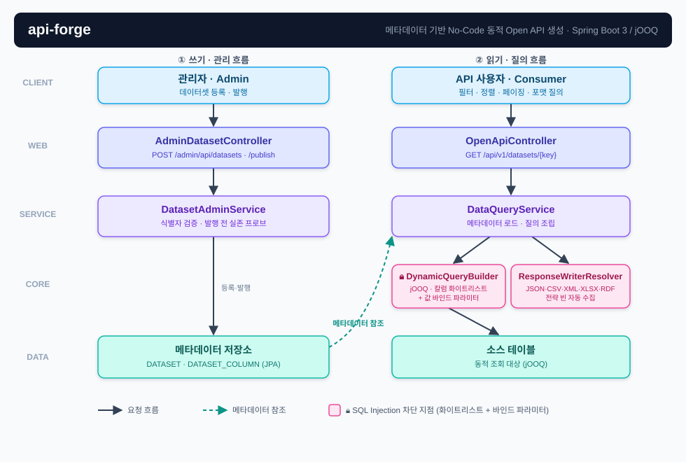

# api-forge

[](https://github.com/hello-pebble/api-forge/actions/workflows/ci.yml)
[](https://openjdk.org/projects/jdk/21/)
[](https://spring.io/projects/spring-boot)

> **메타데이터 기반 No-Code 동적 Open API 생성 플랫폼**
>
> 관리자가 DB 테이블·칼럼 설정만 등록하면, 코드 수정·배포 없이 즉시 필터·정렬·페이징·멀티포맷을 지원하는 Open API가 생성됩니다.

## 배경

공공데이터 Open API 시스템(Java 8 / Spring MVC 4 / iBatis 기반 레거시)의 개선 업무에 투입되어, 재사용을 위한 코드 분석·정리 끝에 설계했던 **메타데이터 기반 동적 API 생성 엔진**을, 그 구조적 한계를 되짚어 현대 스택으로 다시 설계한 리팩토링 프로젝트입니다. 원 시스템의 소스는 비공개이며, 이 저장소는 핵심 아키텍처만 클린룸으로 재구현한 것입니다. 목표는 레거시 분석에서 확인한 문제(문자열 SQL 조립, XML 설정 산재, 타입 불안정)를 설계 차원에서 해결하는 것입니다.

| 레거시 (개선 대상 시스템) | api-forge (재설계) |
|---|---|
| 문자열 연결 SQL 조립 + 블랙리스트 인젝션 필터 | **jOOQ 타입 세이프 DSL + 메타데이터 화이트리스트** — 식별자는 등록된 것만, 값은 전부 바인드 파라미터 |
| `switch` 포맷 분기 (수정 시 코드 변경) | **Writer 전략 빈 자동 수집** — 구현체 추가만으로 신규 포맷 등록 |
| XML 설정 + 메서드 명명 규칙 트랜잭션 | Spring Boot 3 자동설정 + `@Transactional` |
| `Map` 기반 파라미터 (타입 불안정) | DTO + Bean Validation |
| 평문 인증키 관리 | **해시 저장 API 키 + 일자별 사용량 집계** (원문 1회 노출, 상수 시간 검증) |
| 수동 테스트 | 단위·통합 테스트 50건 (H2 38 + PostgreSQL 12) + GitHub Actions CI |

## 레거시 대비 기능 범위

원 시스템은 **관리 화면**(데이터셋 관리 → API 서비스 등록 → 컬럼 옵션 설정)과
전자정부 표준프레임워크 기반 백엔드로 구성되어 있었습니다.
api-forge는 화면을 재구현하지 않고, **화면 뒤의 도메인 로직만 REST로 재설계**했습니다.

### 메타데이터 3계층 구조

레거시는 메타데이터를 세 계층으로 나눠 관리했고, api-forge도 같은 분리를 유지합니다.

| 계층 | 레거시 | api-forge |
|---|---|---|
| 1. 스키마 정의 | 데이터셋 — 소스 테이블 + 컬럼(형식·길이·필수여부·참조코드) | `Dataset` + `DatasetColumn` |
| 2. 노출 정의 | API 서비스 — 데이터셋 참조, 요청주소, 출력 컬럼·정렬 | `datasetKey` + 발행 상태 |
| 3. 필터 정의 | 컬럼 옵션 — 필터유형, 연산자, 데이터 제한 | `FilterType` (EQUALS/WORDS/CHECK/DATE/NONE) |

3계층에서 가장 큰 변경은 **연산자를 자유 선택에서 열거형으로 고정**한 것입니다.
레거시는 관리자가 연산자를 조합할 수 있었고, 그만큼 SQL 조립 경로가 넓었습니다.
api-forge는 필터 유형별 SQL을 코드에 고정하고 메타데이터에는 유형만 저장합니다.
표현력을 줄이는 대신 조립 경로를 유한하게 만드는 선택입니다.

### 기능별 처리

| 레거시 기능 | api-forge | 처리 | 근거 |
|---|---|---|---|
| 필터 유형 + 연산자 | `FilterType` 5종 | 계승 (범위 축소) | 조립 경로를 유한하게 |
| 다중 출력 포맷 | Writer 전략 5종 (json/csv/xml/excel/rdf) | 계승 (구조 변경) | `switch` 분기 → 빈 자동 수집 |
| 요청주소 중복 확인 | `datasetKey` 유니크 제약 | 계승 | 동일 목적, DB 레벨로 이동 |
| 활용통계 · 사용 모니터링 | (키, 데이터셋, 일자) 집계 카운터 | 계승 (단순화) | 원본 로그 미저장 |
| 소스 스키마 실존 검증 | 발행 시 프로브 | 계승 | 레거시 "칼럼불러오기"의 축소판 |
| 인증키 관리 | 해시 저장 + 상수 시간 검증 | 대체 | 레거시는 평문 관리 |
| 데이터셋 버전 (V1 라디오) | 미구현 | **보류** | 스키마 변경 감지와 함께 설계해야 의미가 있어 로드맵으로 분리 |
| 일일 호출 건수 제한 | 미구현 | **보류** | 일자 집계 카운터를 재활용하면 되므로 후순위 |
| Sheet 출력 (출력정렬·출력크기) | 미구현 | **제외** | 화면 표현 속성은 API 응답의 책임이 아니라고 판단. 정렬·너비는 소비하는 쪽에서 결정 |
| 컬럼 참조코드 (공통코드 치환) | 미구현 | **제외** | 공통코드 관리 자체가 별도 도메인. 코드 치환은 조회 엔진 밖에 두는 편이 결합도가 낮음 |
| 관리 화면 (UI) | 미구현 | **제외** | 재설계 대상은 엔진이며, 화면은 REST로 대체 가능 |

### 신규 조회 API 추가 비용

| | 레거시 | api-forge |
|---|---|---|
| 수정 파일 | **5개** — Controller · Service · ServiceImpl · DAO · SQL XML<br>(화면 동반 시 JSP 포함 6개) | **0개** |
| 재배포 | 필요 | 불필요 |
| 방식 | 소스 수정 | 데이터셋 등록 → 발행 |

### 페이징 — 방언 결합의 실제 지점

레거시의 페이징은 두 방식이 공존했습니다.

| 경로 | 방식 | 특성 |
|---|---|---|
| 조회 SQL | XML에 고정된 ROWNUM 공통 래퍼 + 바인드 변수 | Oracle 계열(Tibero) 방언에 결합 — DB를 바꾸면 래퍼도 함께 바꿔야 함 |
| 관리 화면 목록 (기본값) | 방언 무관 ResultSet 스크롤 | DB 독립적이지만 페이지가 깊어질수록 커서 이동 비용 증가 |

api-forge는 페이징을 jOOQ `limit().offset()` 하나로 통일합니다.
방언별 SQL 렌더링은 jOOQ가 담당하므로 페이징 코드는 DB와 무관하고, `size`는 1..100으로 클램프됩니다.

### 다중 DB

레거시의 DB 전환은 쿼리 내부 분기가 아니라 **SQL 맵 세트를 통째로 교체**하는 구조였습니다.
datasource 설정이 방언별 SQL 맵 설정과 방언 디렉터리(`sqlmap/tibero/**/*.xml`, 파일명 `*_Sql_Tibero.xml`)를
참조하고, 표준프레임워크가 제공하는 5종(mysql · oracle · altibase · tibero · cubrid) 중 하나를 선택합니다.
그러나 **실제 운영은 Tibero 단일**이었고 SQL 맵 디렉터리도 1종만 존재했습니다 —
전환 구조는 있었지만 검증된 적이 없고, DB를 추가하려면 전체 SQL 맵을 방언별로 복제해야 합니다.

api-forge는 SQL을 파일로 관리하지 않으므로 방언별로 복제할 SQL 자산 자체가 없습니다.
jOOQ가 같은 쿼리 정의를 방언별 SQL로 렌더링하고, H2 · PostgreSQL 2종을 Spring Profile로 전환하며,
Testcontainers로 실제 PostgreSQL 컨테이너를 띄워 **동일 동작과 인젝션 방어 이식성을 검증**합니다.
지원 DB 수를 늘린 것이 아니라, 검증되지 않았던 구조를 검증 가능한 형태로 바꾼 것입니다.

### 범위와 한계

- 레거시 원본 소스는 비공개이며, 이 저장소는 구조만 클린룸으로 재구현한 것입니다.
- 레거시의 메타데이터 엔진은 **설계·프로토타입 단계까지 진행되었고 운영 반영 전 이직**했습니다.
  실 트래픽·동시성 검증은 수행되지 않았습니다.
- api-forge 역시 관리 화면이 없고, 부하 테스트와 운영 배포 이력이 없습니다.

## 아키텍처



**핵심 흐름** — 레거시와 동일한 개념, 안전한 구현:

1. 관리자가 데이터셋(소스 테이블 + 노출 칼럼 + 필터 유형)을 등록·발행
2. 요청 파라미터를 등록된 칼럼 메타데이터와 대조 (미등록 칼럼 → 400)
3. jOOQ DSL로 SELECT/WHERE/ORDER BY 조립 — 값은 전부 바인드 파라미터
4. 결과셋을 format 파라미터에 맞는 Writer 전략으로 직렬화

## 실행

```bash
./mvnw spring-boot:run
```

시드 데이터(의안 정보 예시, 가상 데이터 15건)가 자동 등록·발행됩니다.

데이터 질의에는 API 키가 필요합니다(`X-API-Key` 헤더). 데모 키가 함께 시드됩니다: `demo-api-key-000000000000000000000000`

```bash
# 카탈로그 — 키 없이 공개 조회 (사용 가능한 데이터셋·필터·정렬 칼럼 확인)
curl http://localhost:8080/api/v1/datasets

# 이하 데이터 질의는 데모 키 사용
KEY="demo-api-key-000000000000000000000000"

# 기본 조회
curl -H "X-API-Key: $KEY" "http://localhost:8080/api/v1/datasets/bills"

# 필터 + 정렬 + 페이징
curl -H "X-API-Key: $KEY" "http://localhost:8080/api/v1/datasets/bills?COMMITTEE=행정안전위원회&sort=PROPOSE_DT,desc&page=0&size=10"

# 의안명 부분 검색 (WORDS) / 날짜 범위 (DATE)
curl -H "X-API-Key: $KEY" "http://localhost:8080/api/v1/datasets/bills?BILL_NM=데이터"
curl -H "X-API-Key: $KEY" "http://localhost:8080/api/v1/datasets/bills?PROPOSE_DT=2026-01-01,2026-03-31"

# 멀티 포맷 — json(기본) · csv · xml · excel(.xlsx) · rdf
curl -H "X-API-Key: $KEY" "http://localhost:8080/api/v1/datasets/bills?format=csv"
curl -H "X-API-Key: $KEY" "http://localhost:8080/api/v1/datasets/bills?format=xml"
curl -H "X-API-Key: $KEY" "http://localhost:8080/api/v1/datasets/bills?format=rdf"
curl -H "X-API-Key: $KEY" -o bills.xlsx "http://localhost:8080/api/v1/datasets/bills?format=excel"
```

### 새 API를 코드 없이 만들기

```bash
# 1. 데이터셋 등록 (관리자 인증: 기본 admin/admin1234 — 데모용, 환경변수로 재정의)
curl -X POST http://localhost:8080/admin/api/datasets \
  -u admin:admin1234 -H "Content-Type: application/json" \
  -d '{
    "datasetKey": "bills-mini",
    "name": "의안 요약",
    "sourceTable": "NA_BILL",
    "columns": [
      {"sourceColumn": "BILL_ID", "displayName": "의안번호", "filterType": "EQUALS", "sortable": true},
      {"sourceColumn": "BILL_NM", "displayName": "의안명", "filterType": "WORDS", "sortable": false}
    ]
  }'

# 2. 발행 — 소스 테이블·칼럼 실존 검증 후 즉시 노출
curl -X POST http://localhost:8080/admin/api/datasets/bills-mini/publish -u admin:admin1234

# 3. 끝. 배포 없이 새 API가 살아있다
curl http://localhost:8080/api/v1/datasets/bills-mini
```

## 필터 유형

| FilterType | SQL | 요청 예시 |
|---|---|---|
| `EQUALS` | `col = ?` | `?BILL_ID=2200001` |
| `WORDS` | `col ILIKE %?%` | `?BILL_NM=데이터` |
| `CHECK` | `col IN (?, ?)` | `?COMMITTEE=행안위,정무위` |
| `DATE` | `col BETWEEN ? AND ?` | `?PROPOSE_DT=2026-01-01,2026-06-30` |
| `NONE` | 필터 불가 (노출 전용) | — |

## 보안 설계

- **식별자 화이트리스트**: 테이블·칼럼명은 관리자가 등록한 메타데이터에 있는 것만 SQL에 진입. 등록 시에도 `[A-Za-z][A-Za-z0-9_]*` 규칙 검증
- **값 바인딩**: 요청 값은 예외 없이 jOOQ 바인드 파라미터 — `?BILL_ID=' OR '1'='1` 은 그냥 0건짜리 문자열 검색 (통합 테스트로 증명)
- **발행 게이트**: DRAFT 상태는 포털 미노출, 발행 시 소스 실존 프로브 검증
- **RBAC**: `/admin/**`은 ADMIN 권한 필요, 데이터 질의는 API 키 필요, 카탈로그는 공개
- **API 키 저장**: 원문은 발급 시 1회만 노출하고 DB엔 SHA-256 해시만 저장, 인증은 상수 시간 비교

## API 키 & 사용량 통계

데이터 질의 엔드포인트는 API 키로 보호됩니다(공공데이터포털의 인증키 발급 모델). 카탈로그는 공개로 두어 탐색은 자유롭게, 데이터 소비는 키 기반으로 추적합니다.

```bash
# 키 발급 (관리자) — rawKey는 이 응답에서만 확인 가능
curl -X POST http://localhost:8080/admin/api/keys \
  -u admin:admin1234 -H "Content-Type: application/json" \
  -d '{"label":"모바일 앱"}'
# → { "rawKey": "3f9c...(48 hex)", "keyPrefix": "3f9c...", "notice": "..." }

# 발급 키로 데이터 질의
curl -H "X-API-Key: 3f9c...(48 hex)" "http://localhost:8080/api/v1/datasets/bills"

# 키 목록 (원문·해시 미노출)
curl -u admin:admin1234 http://localhost:8080/admin/api/keys

# 사용량 통계 — 총 호출수 + (데이터셋, 일자)별 집계
curl -u admin:admin1234 http://localhost:8080/admin/api/keys/{keyPrefix}/usage

# 키 폐기 — 이후 해당 키 요청은 401
curl -X POST -u admin:admin1234 http://localhost:8080/admin/api/keys/{keyPrefix}/revoke
```

**설계 포인트**
- 키 조회는 원문 앞 12자 `keyPrefix` 인덱스로 O(1), 검증은 `MessageDigest.isEqual`(상수 시간)
- 사용량은 요청 로그를 원본 저장하지 않고 `(키, 데이터셋, 일자)` 단위로 **집계 카운터**만 누적 — 조회·저장 비용 최소화
- 카운터 증가는 조건부 UPDATE→없으면 INSERT (이식성 우선). 운영에선 DB 업서트(`ON CONFLICT`/`MERGE`)로 원자화 가능 — 코드에 주석으로 명시

## 다중 DB 지원 (H2 · PostgreSQL)

레거시가 5종 DB를 설정값 하나로 전환하던 구조를 Spring Profile로 재현했습니다.

```bash
# 기본: H2 인메모리 (설정 불필요)
./mvnw spring-boot:run

# PostgreSQL: 프로필 전환 — 접속 정보는 환경변수로 주입
SPRING_PROFILES_ACTIVE=postgres DB_HOST=localhost DB_USER=apiforge DB_PASSWORD=apiforge ./mvnw spring-boot:run

# PostgreSQL + 앱을 한 번에 (Docker Compose)
docker compose up
```

**식별자 이식성** — PostgreSQL은 미인용 식별자를 소문자로, H2/Oracle은 대문자로 접습니다. 소스 테이블 DDL의 식별자를 인용 대문자로 고정하고 jOOQ가 동일하게 렌더링하도록 맞춰, 같은 메타데이터·같은 쿼리 엔진이 두 DB에서 그대로 동작합니다.

## 테스트 & CI

```bash
./mvnw verify
```

- `DynamicQueryBuilderTest` — 필터·정렬·화이트리스트·인젝션 거부 단위 검증
- `OpenApiIntegrationTest` — 등록→발행→조회 E2E, 포맷·보안·페이징 검증 (H2)
- `ApiKeyIntegrationTest` — 키 발급·인증·폐기·사용량 집계 검증
- `PostgresIntegrationTest` — **Testcontainers**로 실제 PostgreSQL 컨테이너를 띄워 동일 동작·인젝션 방어 이식성 검증 (Docker 없으면 자동 스킵)
- GitHub Actions: push/PR마다 `mvnw verify` (러너의 Docker로 Testcontainers 실행)

> **로컬에서 Testcontainers가 스킵될 때** — Docker Desktop(Windows)에서 Testcontainers가 데몬을 못 찾으면 엔진 파이프를 지정합니다:
> ```bash
> export DOCKER_HOST='npipe:////./pipe/dockerDesktopLinuxEngine'   # Windows Docker Desktop
> ./mvnw verify
> ```
> Testcontainers 없이 실제 Postgres로 수동 확인하려면 `docker compose up`으로 앱+DB를 띄우고 `curl`로 엔드포인트를 호출하면 됩니다.

## 기술 스택

Java 21 · Spring Boot 3.5 · Spring Data JPA (메타데이터 저장) · jOOQ (동적 쿼리) · Spring Security 6 · Apache POI (Excel) · H2 / PostgreSQL · Testcontainers · Maven · GitHub Actions

## 로드맵

- [x] PostgreSQL 프로필 + Testcontainers 통합 테스트
- [x] API 키 발급·사용량 통계 (레거시의 인증키 관리 재설계)
- [x] Excel(POI)·RDF Writer 추가
- [ ] 데이터셋 버저닝과 스키마 변경 감지
- [ ] 키별 요청 rate limiting (일자 집계 카운터 재활용)
